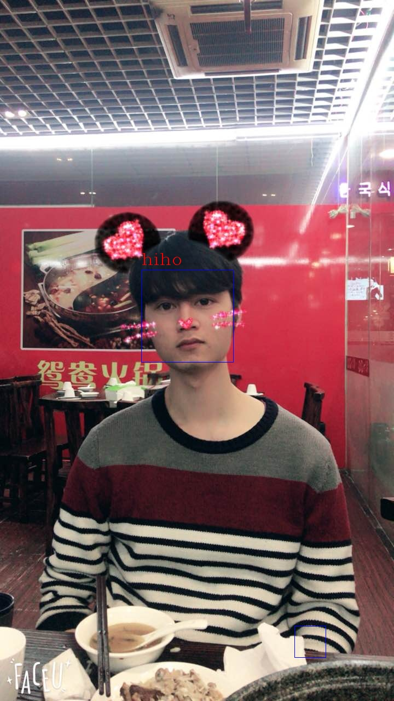
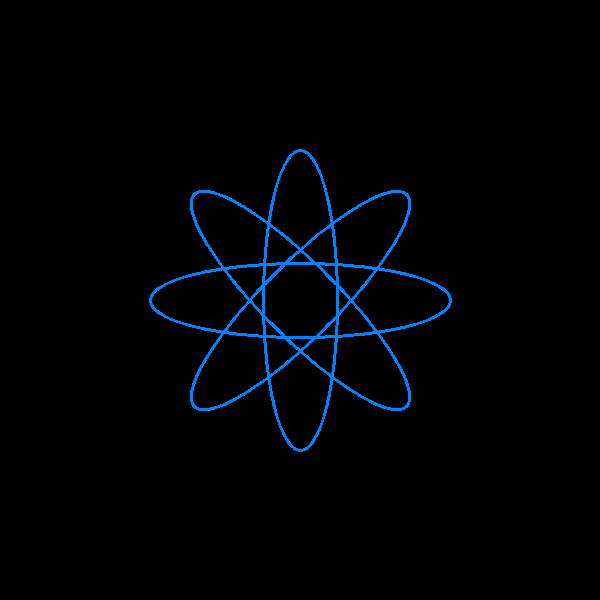

# PHP-OPENCV - PHP extension for Opencv

[](https://travis-ci.org/hihozhou/php-opencv) [](https://php.net/)


## Document
- [PHP OpenCV Doc](http://phpopencv.org/zh-cn/docs/)
- [PHP OpenCV Api](http://phpopencv.org/zh-cn/api/)


## Requirements

- OpenCV 3.4+
- PHP7.0+


## Installation

```bash
git clone https://github.com/hihozhou/php-opencv.git
cd php-opencv
phpize
./configure --with-php-config=your php-config path
make
make install
```

## Configure

php.ini

```
extension="your opencv.so path"
```
## Example

### LBPH face recognition

```php
use CV\Face\LBPHFaceRecognizer;
//use ...;

$src = imread('facePic.jpg');
$gray = cvtColor($src, COLOR_BGR2GRAY);
equalizeHist($gray, $gray);
$faceRecognizer = LBPHFaceRecognizer::create();
/* ... */ //get $images and $labels for train
$faceRecognizer->train($images, $labels);//How to get $image and $labels, see the document
/* ... */ //Face detection using CascadeClassifier
$faceLabel = $faceRecognizer->predict($gray);
/* ... */ //draw face and name
```

result:




### Image Processing

```php
//Obama.php
use function CV\{ imread, imshow, waitkey, namedWindow};

$im = imread('Obama.png');//load image
namedWindow('This is Obama id card',WINDOW_FULLSCREEN);//create window
imshow('This is Obama id card',$im);//show image on window

waitkey(0);

```

result:


Load image by gray

```php
$gray = imread('Obama.png',IMREAD_GRAYSCALE);
//or
use  function CV\{ cvtColor};
$gray = cvtColor($im, COLOR_BGR2GRAY);

```


You can draw something.  
e.g:  

```php
use CV\{Mat,Scalar, Point, Size};
use function CV\{ellipse, imwrite, waitKey};
use const CV\{CV_8UC3};

$windowWidth = 600;
$thickness = 2;
$lineType = 8;
$matScalar = new Scalar(0,0,0);
$mat = new Mat($windowWidth, $windowWidth, CV_8UC3, $matScalar);
$point=new Point($windowWidth/2, $windowWidth/2);
$size=new Size($windowWidth/4, $windowWidth/16);
$scalar=new Scalar(255, 129, 0);
for($i = 0; $i <= 360; $i += 45){
    ellipse($mat,$point,$size,$i,0,360,$scalar,$thickness,$lineType);
}
imwrite('./tests/ellipse.png',$mat);

```

result:




## Features
- [x] 1.[core](http://phpopencv.org/zh-cn/docs/mat.html)
- [x] 2.[imgproc](http://phpopencv.org/zh-cn/docs/gausian_median_blur_bilateral_filter.html)
- [x] 3.highgui
- [ ] 4.contrib
- [ ] 5.features2d
- [ ] 6.flann
- [ ] 7.gpu
- [ ] 8.calib3d
- [ ] 9.legacy
- [x] 10.ml
- [ ] 11.nonfree
- [x] 12.objdetect
- [ ] 13.ocl
- [ ] 14.photo
- [ ] 15.stitching
- [ ] 16.superres
- [ ] 17.ts
- [x] 18.video
- [ ] 19.Videostab


## Contributors

[@hihozhou](https://github.com/hihozhou)  
[@MaleicAcid](https://github.com/MaleicAcid)
    
## 感谢

感谢[韩天峰](https://github.com/matyhtf)老大的指导，  
感谢[盘古大叔](https://github.com/pangudashu)的[php7-internal](https://github.com/pangudashu/php7-internal)项目以及平常的指导，  
感谢`木桶技术升级交流群`和`黑夜路人技术群`、以及`PHP内核交流`的群友对技术的帮助。
